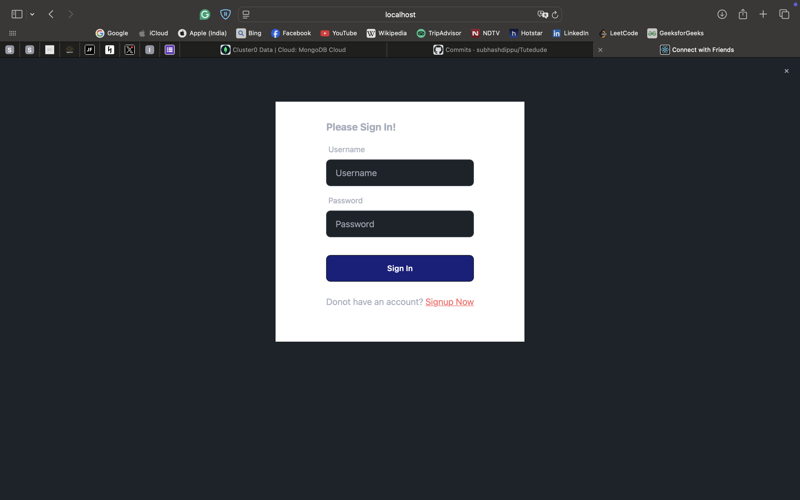
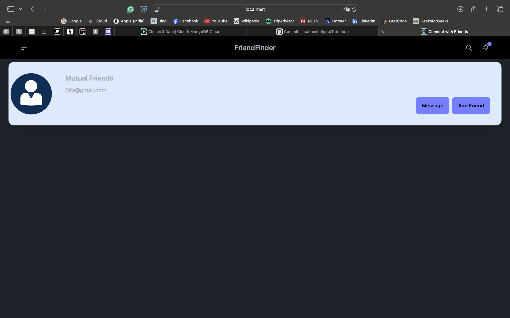
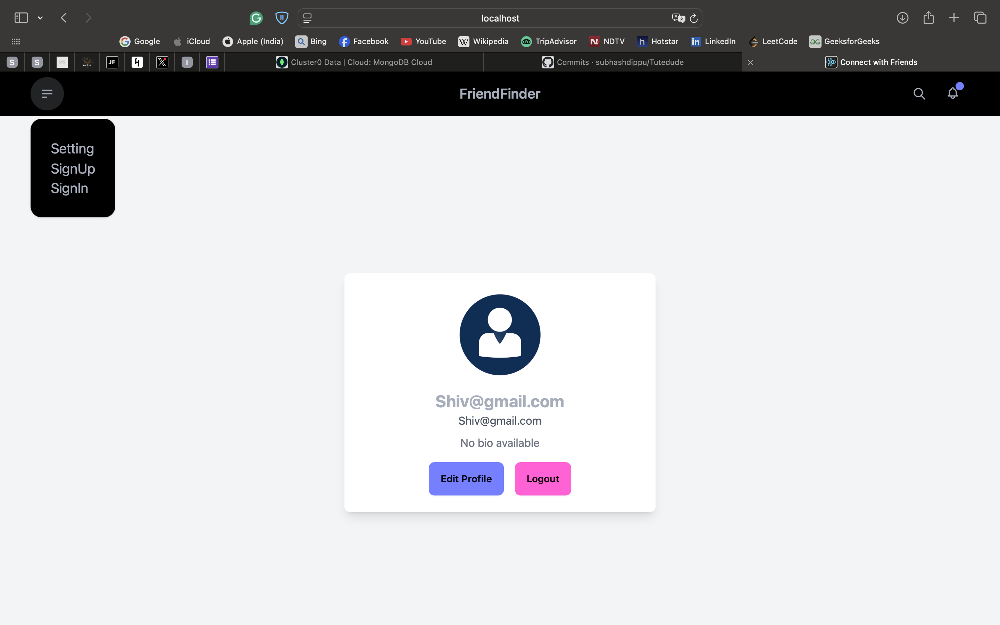

# [FriendFinder](<(https://client-three.vercel.app)>)

## 📌 Introduction

[](https://awesome.re)

FriendFinder is a responsive web application designed to simplify social interactions. It enables users to securely sign up, log in, search for others, send, accept, or reject friend requests, and receive recommendations based on mutual connections. With an intuitive interface and seamless functionality, FriendFinder fosters meaningful connections across all devices.

## 🚀 View Live Demo


<pre><center><a href="[https://food-app-client-three.vercel.app](https://tutedude-6kzz.vercel.app/)"><b>https://food-app-client-three.vercel.app</b></a></center></pre>

## 👨‍💻 Tech Stack Used

### Frontend

- ReactJS, TailwindCSS, JavaScript, Axios, React-icons

### Backend

- Node.js, Express.js, JWT, MongoDB

## Folder Structure

```bash
mern-stack-project/
├── backend/
│   ├── config/
│   │   └── db.js
│   ├── controllers/
│   │   ├── authController.js
│   │   ├── friendController.js
│   │   └── userController.js
│   ├── models/
│   │   ├── User.js
│   │   └── Friend.js
│   ├── routes/
│   │   ├── authRoutes.js
│   │   ├── userRoutes.js
│   │   └── friendRoutes.js
│   ├── middleware/
│   │   └── authMiddleware.js
│   ├── .env
│   ├── server.js
│   └── package.json
├── frontend/
│   ├── public/
│   │   └── index.html
│   ├── src/
│   │   ├── components/
│   │   │   ├── FriendList.js
│   │   │   ├── MutualFriend.js
│   │   │   ├── Navbar.js
│   │   │   └── UserData.js
│   │   ├── pages/
│   │   │   ├── Home.js
│   │   │   └── Main.js
│   │   │   └── SignIn.js
│   │   │   └── SignUp.js
│   │   ├── App.js
│   │   ├── index.js
│   │   ├── App.css
│   │   │
│   └── package.json
├── README.md
└── .gitignore

```

## 🛠️ Installation Steps

Star and Fork the Repo 🌟 and this will keep us motivated.

1. Clone the repository

```bash
git clone https://github.com/subhashdippu/Tutedude.git
```

2. Change the working directory

```bash
cd Tutedude
```

3. Install dependencies

```bash
npm install
```

4. Run the app

```bash
npm run start
```

## 📸 Screenshots





